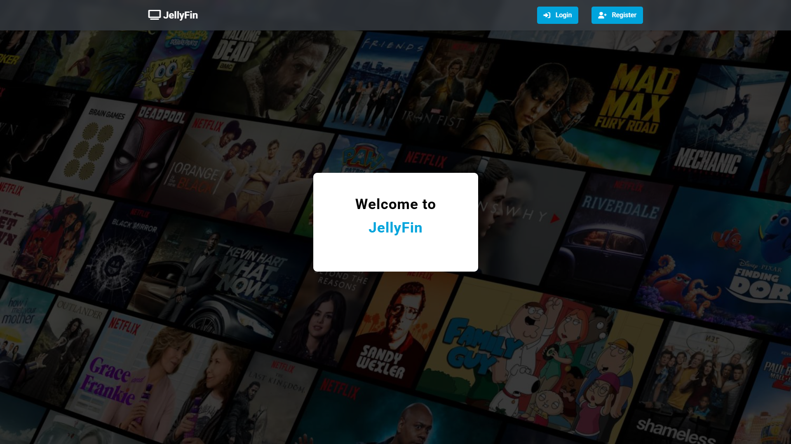
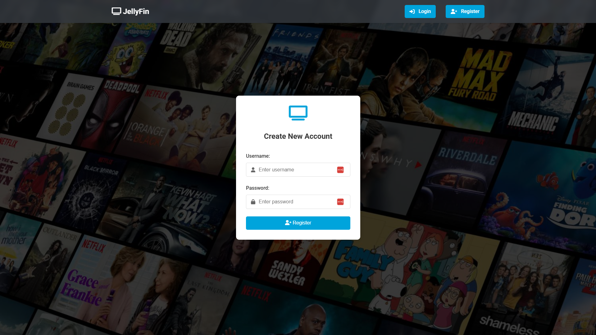

# Jellyfin Registration Portal

A lightweight registration portal for Jellyfin that provides a clean, modern interface for new users to create accounts. This is **not** a Jellyfin plugin, but rather a standalone registration page that works alongside your Jellyfin instance.

## Preview

### Welcome Screen

*The Jellyfin welcome screen that users first see*

### Registration Form

*Clean, modern registration form for new users*

## Overview

This project provides a simple way to add a registration system to your Jellyfin server without modifying the Jellyfin installation. It acts as a bridge between your users and your Jellyfin instance.

### How it Works

The system uses a two-domain approach:

Example 1:
```
register.triler.eu (Registration Portal) -> tv.triler.eu (Jellyfin Server)
```

Example 2:
```
jellyfin.yourdomain.com (Registration Portal) -> tv.yourdomain.com (Jellyfin Server)
```

Example 3:
```
register.movies.com (Registration Portal) -> watch.movies.com (Jellyfin Server)
```

The workflow:
1. Users visit your registration portal (e.g., `register.triler.eu`)
2. They create an account through the modern interface
3. Upon successful registration, they are redirected to your Jellyfin instance (e.g., `tv.triler.eu`)
4. They can now log in to Jellyfin with their new account

## Features

- Clean, modern registration interface
- Mobile-responsive design
- User-friendly error messages
- Secure password handling
- Direct integration with Jellyfin API
- Semi-transparent design with blur effects
- Easy to customize and brand

## Setup

1. Configure your Jellyfin instance (e.g., at `tv.yourdomain.com`)
2. Set up the registration portal on a separate subdomain (e.g., `register.yourdomain.com`)
3. Update `config.php` with your settings:
   ```php
   // Your Jellyfin server URL
   define('JELLYFIN_HOST', 'https://tv.yourdomain.com');
   // Your Jellyfin API key
   define('JELLYFIN_API_KEY', 'your-api-key');
   // Login redirect URL (usually same as JELLYFIN_HOST)
   define('LOGIN_URL', 'https://tv.yourdomain.com');
   ```
4. Upload the files to your web server
5. Point your registration subdomain to the portal

## Requirements

- PHP 7.4 or higher
- cURL extension
- Web server (Apache/Nginx)
- SSL certificate (recommended)
- Jellyfin server with API access
- Two subdomains (one for registration, one for Jellyfin)

## Security Notes

- Always use HTTPS for both domains
- Keep your API key secure
- Regularly update your dependencies
- Consider implementing rate limiting
- Monitor registration attempts
- Use different subdomains for security separation

## License

MIT License - Feel free to use and modify as needed.

## Disclaimer

This is not an official Jellyfin plugin. It's a standalone project that interacts with Jellyfin through its API. Use at your own discretion. 